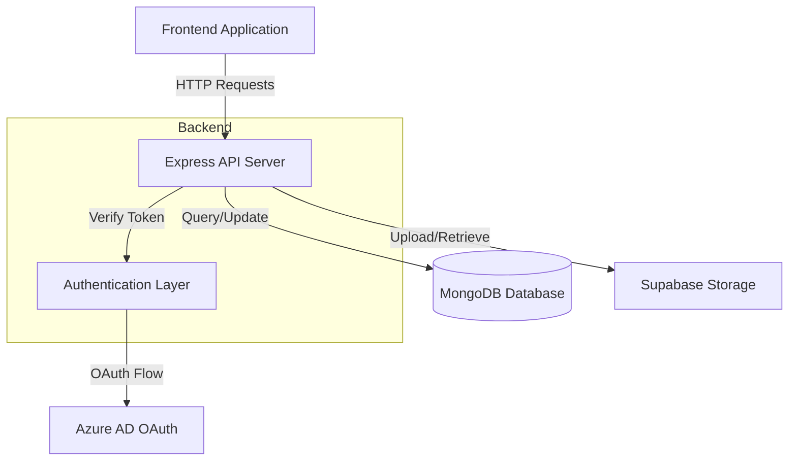
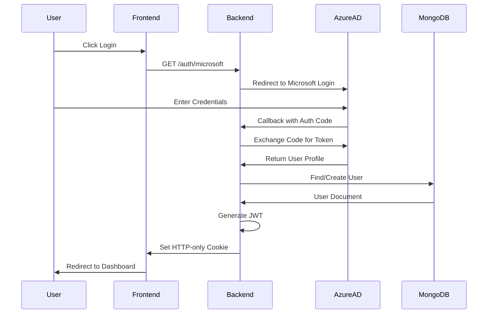
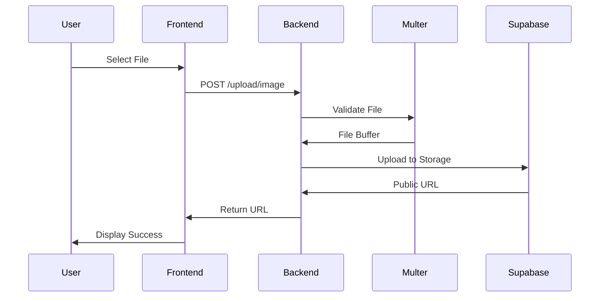

# NU Project Showcaser - Backend API


A comprehensive backend API for showcasing university student projects, built with Node.js, Express, TypeScript, and MongoDB. This platform enables students to submit, share, and discover academic projects while providing administrators and teaching assistants with tools to manage and review submissions.

## Table of Contents

- [Features](#features)
- [Technology Stack](#technology-stack)
- [Project Structure](#project-structure)
- [Getting Started](#getting-started)
- [API Documentation](#api-documentation)
- [Data Models](#data-models)
- [Environment Variables](#environment-variables)
- [Security Features](#security-features)
- [Development](#development)
- [Deployment](#deployment)
- [Architecture](#architecture)
- [Contributing](#contributing)
- [License](#license)

## Features

### Authentication & Authorization
- **Microsoft Azure AD OAuth 2.0** - Seamless single sign-on for university users
- **JWT Token Authentication** - Secure HTTP-only cookie-based authentication
- **Session Management** - Persistent sessions with MongoDB store in production
- **Role-Based Access Control** - Three distinct roles: Student, Supervisor, and Admin
- **Profile Management** - Complete user profile creation and updates

### Project Management
- **Full CRUD Operations** - Create, read, update, and delete projects
- **Advanced Search** - Search projects by title, description, technologies, and tags
- **Featured Projects** - Highlight exceptional projects on the platform
- **Project Starring** - Users can bookmark/star their favorite projects
- **Related Projects** - Intelligent suggestions based on technologies and tags
- **Bulk Creation** - Import multiple projects at once
- **Approval Workflow** - Teaching Assistant review and approval system
- **Status Tracking** - Monitor project status (pending, approved, rejected)
- **Rich Media Support** - Multiple images and video attachments per project

### User Management
- **User Registration** - Traditional email/password registration
- **OAuth Integration** - Microsoft account integration for university users
- **Profile Completion** - Multi-step profile setup for first-time users
- **Starred Projects Tracking** - Personal collection of favorited projects
- **Account Deactivation** - User-initiated account deactivation requests
- **Admin User Management** - Full administrative control over user accounts

### Comment System
- **Project Comments** - Users can comment on any project
- **Comment Threading** - Organized discussions per project
- **Edit & Delete** - Users can manage their own comments
- **Author Information** - Full attribution with user details

### File Upload System
- **Multi-Image Upload** - Support for up to 10 images per upload
- **Video Upload** - Single video file upload with validation
- **Supabase Integration** - Cloud storage for all media files
- **File Validation** - Type and size restrictions via Multer middleware
- **Error Handling** - Comprehensive error messages for failed uploads

### Academic Structure
- **Schools Management** - Organize by university schools/faculties
- **Majors Tracking** - Link schools to their respective majors
- **Course Catalog** - Complete course code and title management
- **Project-Course Association** - Link projects to specific courses

### Suggestion System
- **User Feedback** - Collect improvement suggestions from users
- **Image Attachments** - Visual feedback with image support
- **Admin Review** - Management interface for processing suggestions

### Email Notifications
- **Nodemailer Integration** - Professional email delivery
- **Status Updates** - Notify users of project approval/rejection
- **Customizable Templates** - Flexible email content

### Admin Dashboard
- **Statistics Overview** - Real-time platform metrics
- **Resource Management** - Full CRUD on all system resources
- **User Role Management** - Promote/demote user privileges
- **Bulk Operations** - Efficient management of multiple records

## Technology Stack

### Backend Framework
- **Node.js** - Runtime environment
- **Express.js** - Web application framework
- **TypeScript** - Type-safe development

### Database & Storage
- **MongoDB** - Primary database with Mongoose ODM
- **connect-mongo** - Session store for production
- **Supabase** - Cloud storage for images and videos

### Authentication & Security
- **Passport.js** - Authentication middleware
- **passport-azure-ad** - Microsoft OAuth strategy
- **jsonwebtoken** - JWT token generation and verification
- **bcrypt** - Password hashing
- **Helmet.js** - Security headers
- **CORS** - Cross-origin resource sharing configuration
- **express-validator** - Input validation and sanitization

### File Handling
- **Multer** - Multipart/form-data file upload handling
- **Supabase Storage** - Cloud file storage service

### Development Tools
- **ts-node** - TypeScript execution for development
- **nodemon** - Auto-restart on file changes
- **TypeScript Compiler** - Type checking and compilation

### Additional Libraries
- **morgan** - HTTP request logger
- **cookie-parser** - Parse Cookie header
- **dotenv** - Environment variable management
- **express-session** - Session middleware

### CI/CD
- **GitHub Actions** - Automated testing and builds

## Project Structure

```
NU-Project-Showcaser-BE/
├── src/
│   ├── app.ts                      # Express app configuration
│   ├── server.ts                   # Server entry point & MongoDB connection
│   │
│   ├── config/                     # Configuration files
│   │   ├── passport.ts             # Azure AD OAuth 2.0 setup
│   │   ├── supabase.ts             # Supabase client initialization
│   │   └── multer.ts               # File upload configuration
│   │
│   ├── controllers/                # Request handlers
│   │   ├── authController.ts       # Authentication logic
│   │   ├── projectController.ts    # Project CRUD operations
│   │   ├── userController.ts       # User management
│   │   ├── commentController.ts    # Comment operations
│   │   ├── courseController.ts     # Course management
│   │   ├── schoolController.ts     # School management
│   │   ├── suggestionController.ts # Suggestion handling
│   │   ├── uploadController.ts     # File upload processing
│   │   ├── notifyController.ts     # Email notifications
│   │   └── adminController.ts      # Admin operations
│   │
│   ├── services/                   # Business logic layer
│   │   ├── authService.ts
│   │   ├── projectService.ts
│   │   ├── userService.ts
│   │   ├── commentService.ts
│   │   ├── courseService.ts
│   │   ├── schoolService.ts
│   │   ├── suggestionService.ts
│   │   ├── uploadService.ts
│   │   ├── notifyService.ts
│   │   └── adminService.ts
│   │
│   ├── models/                     # Mongoose schemas
│   │   ├── projectModel.ts         # Project schema
│   │   ├── userModel.ts            # User schema
│   │   ├── commentModel.ts         # Comment schema
│   │   ├── courseModel.ts          # Course schema
│   │   ├── schoolModel.ts          # School schema
│   │   └── suggestionModel.ts      # Suggestion schema
│   │
│   ├── routes/                     # API routes
│   │   ├── authRoutes.ts           # Authentication endpoints
│   │   ├── projectRoutes.ts        # Project endpoints
│   │   ├── userRoutes.ts           # User endpoints
│   │   ├── commentRoutes.ts        # Comment endpoints
│   │   ├── courseRoutes.ts         # Course endpoints
│   │   ├── schoolRoutes.ts         # School endpoints
│   │   ├── suggestionRoutes.ts     # Suggestion endpoints
│   │   ├── uploadRoutes.ts         # Upload endpoints
│   │   ├── notifyRoutes.ts         # Notification endpoints
│   │   └── Admin/                  # Admin-only routes
│   │       ├── adminRoutes.ts      # Main admin router
│   │       ├── projectAdminRoutes.ts
│   │       ├── userAdminRoutes.ts
│   │       ├── commentAdminRoutes.ts
│   │       ├── suggestionAdminRoutes.ts
│   │       ├── schoolAdminRoutes.ts
│   │       └── courseAdminRoutes.ts
│   │
│   ├── middlewares/                # Custom middleware
│   │   ├── authGuard.ts            # Ensure user authentication
│   │   ├── adminGuard.ts           # Ensure admin role
│   │   ├── jwtCookieAuth.ts        # JWT cookie authentication
│   │   ├── validateJWT.ts          # JWT token validation
│   │   ├── originGuard.ts          # Block direct browser access
│   │   ├── multerErrorHandler.ts   # File upload error handling
│   │   └── validationMiddleware.ts # Input validation
│   │
│   └── Types/                      # TypeScript type definitions
│       └── ExtendedRequest.ts      # Extended Express Request type
│
├── .github/
│   └── workflows/
│       └── backend-ci.yml          # GitHub Actions CI pipeline
│
├── package.json                    # Dependencies and scripts
├── tsconfig.json                   # TypeScript configuration
└── README.md                       # This file
```

## Getting Started

### Prerequisites

- **Node.js** v18.x or higher
- **MongoDB** v5.x or higher
- **Supabase Account** for file storage
- **Azure AD App Registration** for OAuth authentication

### Installation

1. **Clone the repository**
   ```bash
   git clone https://github.com/yourusername/NU-Project-Showcaser-BE.git
   cd NU-Project-Showcaser-BE
   ```

2. **Install dependencies**
   ```bash
   npm install
   ```

3. **Configure environment variables**
   
   Create a `.env` file in the root directory (see [Environment Variables](#environment-variables) section)

4. **Start MongoDB**
   ```bash
   # Using MongoDB locally
   mongod
   
   # Or use MongoDB Atlas connection string in .env
   ```

5. **Run the development server**
   ```bash
   npm run dev
   ```
   
   The server will start at `http://localhost:3000`

### Building for Production

```bash
# Compile TypeScript to JavaScript
npm run build

# Start the production server
npm start
```

## API Documentation

### Base URL
```
Development: http://localhost:3000
Production: https://your-domain.com
```

### Authentication Routes
**Base Path:** `/auth`

| Method | Endpoint | Description | Auth Required |
|--------|----------|-------------|---------------|
| GET | `/microsoft` | Initiate Microsoft OAuth login | No |
| GET | `/callback` | OAuth callback handler | No |
| GET | `/profile` | Get authenticated user profile | Yes |
| GET | `/me` | Check authentication status | No |
| GET | `/logout` | Logout user and clear session | No |

**Example: Check Auth Status**
```bash
curl http://localhost:3000/auth/me \
  -H "Cookie: jwt=your-jwt-token"
```

### Project Routes
**Base Path:** `/project`

| Method | Endpoint | Description | Auth Required |
|--------|----------|-------------|---------------|
| GET | `/` | Get projects with pagination | No |
| GET | `/all` | Get all projects | No |
| GET | `/search?q=term` | Search projects | No |
| GET | `/featured` | Get featured projects | No |
| GET | `/starred` | Get user's starred projects | Yes |
| GET | `/pending-by-ta/:taMail` | Get TA's pending projects | Yes |
| GET | `/related/:id` | Get related projects | No |
| GET | `/:id` | Get project by ID | No |
| POST | `/` | Create new project | Yes |
| POST | `/multiple` | Bulk create projects | No |
| PUT | `/:id` | Update project | No |
| PUT | `/star/:id` | Star/unstar project | Yes |
| DELETE | `/:id` | Delete project | No |

**Example: Create Project**
```bash
curl -X POST http://localhost:3000/project \
  -H "Content-Type: application/json" \
  -H "Cookie: jwt=your-jwt-token" \
  -d '{
    "title": "AI Chatbot",
    "description": "An intelligent chatbot using NLP",
    "technologies": ["Node.js", "Python", "TensorFlow"],
    "teamLeader": {
      "name": "John Doe",
      "email": "john@university.edu"
    },
    "teamMembers": [],
    "supervisor": "Dr. Smith",
    "course": "CS450",
    "tags": ["AI", "NLP", "Machine Learning"]
  }'
```

**Example: Search Projects**
```bash
curl "http://localhost:3000/project/search?q=machine%20learning"
```

### User Routes
**Base Path:** `/user`

| Method | Endpoint | Description | Auth Required |
|--------|----------|-------------|---------------|
| GET | `/profile/:userId` | Get user profile | No |
| POST | `/register` | Register new user | No |
| POST | `/login` | User login | No |
| POST | `/complete-profile` | Complete user profile | Yes |
| PUT | `/update-profile` | Update user profile | Yes |
| PUT | `/request-deactivate` | Request account deactivation | Yes |

**Example: Register User**
```bash
curl -X POST http://localhost:3000/user/register \
  -H "Content-Type: application/json" \
  -d '{
    "firstName": "Jane",
    "lastName": "Doe",
    "email": "jane@university.edu",
    "password": "SecurePass123!"
  }'
```

### Comment Routes
**Base Path:** `/comment`

| Method | Endpoint | Description | Auth Required |
|--------|----------|-------------|---------------|
| GET | `/project/:id` | Get all comments for a project | No |
| GET | `/:id` | Get single comment | No |
| POST | `/` | Add new comment | Yes |
| PUT | `/:id` | Edit comment | Yes |
| DELETE | `/:id` | Delete comment | Yes |

**Example: Add Comment**
```bash
curl -X POST http://localhost:3000/comment \
  -H "Content-Type: application/json" \
  -H "Cookie: jwt=your-jwt-token" \
  -d '{
    "content": "Great project! Very impressive work.",
    "projectId": "65abc123def456789"
  }'
```

### Upload Routes
**Base Path:** `/upload`

| Method | Endpoint | Description | Auth Required |
|--------|----------|-------------|---------------|
| POST | `/image` | Upload images (max 10) | Yes |
| POST | `/video` | Upload video | Yes |
| POST | `/suggestion-image` | Upload suggestion image | No |

**Example: Upload Image**
```bash
curl -X POST http://localhost:3000/upload/image \
  -H "Cookie: jwt=your-jwt-token" \
  -F "file=@/path/to/image.jpg"
```

### School Routes
**Base Path:** `/school`

| Method | Endpoint | Description | Auth Required |
|--------|----------|-------------|---------------|
| GET | `/all` | Get all schools | No |

### Course Routes
**Base Path:** `/course`

| Method | Endpoint | Description | Auth Required |
|--------|----------|-------------|---------------|
| GET | `/all` | Get all courses | No |

### Suggestion Routes
**Base Path:** `/suggestion`

| Method | Endpoint | Description | Auth Required |
|--------|----------|-------------|---------------|
| POST | `/` | Create suggestion | No |
| GET | `/all` | Get all suggestions | No |
| GET | `/:id` | Get suggestion by ID | No |

### Notification Routes
**Base Path:** `/notify`

| Method | Endpoint | Description | Auth Required |
|--------|----------|-------------|---------------|
| POST | `/send-mail` | Send email notification | No |

### Admin Routes
**Base Path:** `/admin` (All require admin role)

| Method | Endpoint | Description |
|--------|----------|-------------|
| GET | `/stats` | Get dashboard statistics |
| GET | `/project/all-projects` | Get all projects (admin view) |
| GET | `/project/:id` | Get project by ID (admin) |
| PUT | `/project/:projectId` | Edit project (admin) |
| DELETE | `/project/:projectId` | Delete project (admin) |
| GET | `/user/all-users` | Get all users |
| GET | `/user/:id` | Get user by ID |
| PUT | `/user/:userId` | Edit user |
| DELETE | `/user/:userId` | Delete user |

## Data Models

### Project Model
```typescript
{
  title: string;              // Project title
  description: string;        // Detailed description
  technologies: string[];     // Technologies used
  teamLeader: {              // Team leader information
    name: string;
    email: string;
  };
  teamMembers: Array<{       // Additional team members
    name: string;
    email: string;
  }>;
  supervisor: string;        // Project supervisor name
  stars: number;             // Number of stars (default: 0)
  tags: string[];            // Project tags for categorization
  course: string;            // Associated course
  images: string[];          // Image URLs from Supabase
  videos: string[];          // Video URLs from Supabase
  repoUrl: string;           // GitHub/GitLab repository URL
  liveUrl: string;           // Live demo URL
  status: string;            // Status (pending, approved, rejected)
  teachingAssistant: string; // TA email for approval
  createdAt: Date;           // Auto-generated timestamp
}
```

### User Model
```typescript
{
  firstName: string;           // User's first name
  lastName: string;            // User's last name
  email: string;               // Unique email address
  password?: string;           // Hashed password (optional for OAuth)
  msId?: string;               // Microsoft account ID (unique)
  starredProjects: string[];   // Array of starred project IDs
  role: string;                // Role: 'student', 'supervisor', 'admin'
  projects: string[];          // User's submitted project IDs
  pendingProjects: string[];   // Projects pending approval
  linkedInUrl: string;         // LinkedIn profile URL
  githubUrl: string;           // GitHub profile URL
  universityId: string;        // University student/staff ID
  school: string;              // School/faculty name
  major: string;               // Major/department
  deactivated: boolean;        // Account status
  deactivateRequested: boolean;// Deactivation request flag
  createdAt: Date;             // Auto-generated timestamp
}
```

### Comment Model
```typescript
{
  content: string;           // Comment text
  projectId: string;         // Associated project ID
  userId: string;            // Author user ID
  authorFirstName: string;   // Author's first name
  authorLastName: string;    // Author's last name
  authorEmail: string;       // Author's email
  createdAt: Date;           // Auto-generated timestamp
}
```

### Suggestion Model
```typescript
{
  title: string;           // Suggestion title
  description: string;     // Detailed description
  images?: string[];       // Optional image URLs
  createdAt: Date;         // Auto-generated timestamp
}
```

### School Model
```typescript
{
  name: string;      // School/faculty name
  majors: string[];  // Available majors
}
```

### Course Model
```typescript
{
  code: string;   // Course code (e.g., "CS450")
  title: string;  // Course title (e.g., "Machine Learning")
}
```

## Environment Variables

Create a `.env` file in the root directory with the following variables:

```env
# Server Configuration
PORT=3000
NODE_ENV=development

# Database
MONGODB_URI=mongodb://localhost:27017/nu-project-showcaser

# Session
SESSION_SECRET=your-super-secret-session-key-change-this

# JWT Authentication
JWT_SECRET=your-super-secret-jwt-key-change-this

# Azure AD OAuth Configuration
AZURE_TENANT_ID=your-azure-tenant-id
AZURE_CLIENT_ID=your-azure-client-id
AZURE_CLIENT_SECRET=your-azure-client-secret
AZURE_REDIRECT_URL=http://localhost:3000/auth/callback

# Supabase Storage
SUPABASE_URL=https://your-project.supabase.co
SUPABASE_SERVICE_ROLE_KEY=your-supabase-service-role-key

# Frontend URLs (comma-separated, no spaces)
FRONTEND_URLS=http://localhost:5173,http://localhost:3001

# Email Configuration (Nodemailer)
EMAIL_HOST=smtp.gmail.com
EMAIL_PORT=587
EMAIL_SECURE=false
EMAIL_USER=your-email@gmail.com
EMAIL_PASS=your-app-specific-password
```

### Azure AD Setup

1. Go to [Azure Portal](https://portal.azure.com)
2. Navigate to Azure Active Directory → App registrations
3. Create a new registration
4. Add redirect URI: `http://localhost:3000/auth/callback`
5. Create a client secret
6. Copy Tenant ID, Client ID, and Client Secret to `.env`

### Supabase Setup

1. Create a [Supabase](https://supabase.com) account
2. Create a new project
3. Go to Settings → API
4. Copy the URL and service_role key to `.env`
5. Create storage buckets for images and videos

## Security Features

### Built-in Security Measures

- **Helmet.js** - Sets various HTTP headers for security
  - Content Security Policy (CSP)
  - X-Frame-Options
  - X-Content-Type-Options
  - Strict-Transport-Security

- **CORS Configuration** - Whitelist-based cross-origin resource sharing
  - Configurable allowed origins
  - Credentials support
  - Method and header restrictions

- **Origin Guard Middleware** - Prevents direct browser access
  - Validates origin and referer headers
  - Blocks unauthorized domains
  - Allows only requests from frontend applications

- **JWT Authentication** - Secure token-based authentication
  - HTTP-only cookies prevent XSS attacks
  - Secure flag in production
  - SameSite attribute configured

- **Role-Based Authorization** - Granular access control
  - Middleware guards for protected routes
  - Admin-only operations
  - User-specific data access

- **Input Validation** - Express-validator integration
  - Request body validation
  - Parameter sanitization
  - Error message standardization

- **Password Security** - bcrypt hashing
  - Salt rounds: 10
  - One-way encryption
  - Rainbow table protection

- **Session Security** - Production-grade session management
  - MongoDB session store (no memory leaks)
  - Secure cookie settings
  - Session expiration

### Best Practices Implemented

- Environment variable usage for sensitive data
- No hardcoded secrets in codebase
- HTTPS enforcement in production
- Trust proxy for Heroku/cloud deployments
- Rate limiting ready (can be added)
- SQL injection prevention via MongoDB parameterization

## Development

### Available Scripts

```bash
# Development mode with hot reload
npm run dev

# Build TypeScript to JavaScript
npm run build

# Start production server
npm start

# Run tests
npm test

# Type check without compilation
npm run type-check
```

### Development Workflow

1. **Create a feature branch**
   ```bash
   git checkout -b feature/your-feature-name
   ```

2. **Make changes and test**
   ```bash
   npm run dev
   ```

3. **Type check your code**
   ```bash
   npm run type-check
   ```

4. **Build the project**
   ```bash
   npm run build
   ```

5. **Commit and push**
   ```bash
   git add .
   git commit -m "feat: add new feature"
   git push origin feature/your-feature-name
   ```

### Code Style Guidelines

- Use TypeScript for all new files
- Follow Express.js best practices
- Use async/await for asynchronous operations
- Implement proper error handling
- Add JSDoc comments for complex functions
- Keep controllers thin, services thick

## Deployment

### Heroku Deployment

1. **Create Heroku app**
   ```bash
   heroku create your-app-name
   ```

2. **Set environment variables**
   ```bash
   heroku config:set MONGODB_URI=your-mongodb-uri
   heroku config:set JWT_SECRET=your-jwt-secret
   # ... set all other env variables
   ```

3. **Deploy**
   ```bash
   git push heroku main
   ```

### Production Checklist

- [ ] Set `NODE_ENV=production`
- [ ] Use MongoDB Atlas for database
- [ ] Configure all environment variables
- [ ] Set secure session secret
- [ ] Update FRONTEND_URLS with production domain
- [ ] Configure Azure AD redirect URL for production
- [ ] Set up Supabase production buckets
- [ ] Enable Heroku automatic deployments (optional)
- [ ] Monitor logs: `heroku logs --tail`

### MongoDB Atlas Setup

1. Create a [MongoDB Atlas](https://www.mongodb.com/cloud/atlas) account
2. Create a new cluster
3. Create a database user
4. Whitelist IP addresses (or allow from anywhere: 0.0.0.0/0)
5. Get connection string and add to `MONGODB_URI`

### CI/CD Pipeline

GitHub Actions workflow automatically:
- Installs dependencies
- Type checks the code
- Builds the project

Located in `.github/workflows/backend-ci.yml`

## Architecture

### System Architecture



### Authentication Flow



### File Upload Flow



### Request Processing Pipeline

```mermaid
graph LR
    Request[Incoming Request]
    Helmet[Helmet Security]
    CORS[CORS Check]
    Origin[Origin Guard]
    Session[Session Check]
    JWT[JWT Auth]
    Guard[Auth/Admin Guard]
    Controller[Controller]
    Service[Service Layer]
    Model[Database Model]
    Response[Response]
    
    Request --> Helmet
    Helmet --> CORS
    CORS --> Origin
    Origin --> Session
    Session --> JWT
    JWT --> Guard
    Guard --> Controller
    Controller --> Service
    Service --> Model
    Model --> Response
```



## Contributing

We welcome contributions! Please follow these guidelines:

### How to Contribute

1. Fork the repository
2. Create a feature branch (`git checkout -b feature/amazing-feature`)
3. Commit your changes (`git commit -m 'feat: add amazing feature'`)
4. Push to the branch (`git push origin feature/amazing-feature`)
5. Open a Pull Request

### Commit Message Convention

Follow [Conventional Commits](https://www.conventionalcommits.org/):

- `feat:` - New feature
- `fix:` - Bug fix
- `docs:` - Documentation changes
- `style:` - Code style changes (formatting, etc.)
- `refactor:` - Code refactoring
- `test:` - Adding or updating tests
- `chore:` - Maintenance tasks

### Pull Request Process

1. Update documentation if needed
2. Ensure all tests pass
3. Add tests for new features
4. Update the README if API changes
5. Request review from maintainers

## License

This project is licensed under the MIT License.

## Contact & Support

- **Project Maintainer:** Mohamed Abdellatif
- **Email:** M.Abdellatif2319@nu.edu.eg
- **Frontend Repository:** [Frontend Repo Link](https://github.com/Mohamed-Abdellatif/NU-Project-Showcaser-FE)
- **Issues:** [GitHub Issues](https://github.com/Mohamed-Abdellatif/NU-Project-Showcaser-BE/issues)

---

**Built with ❤️ for the university community**
